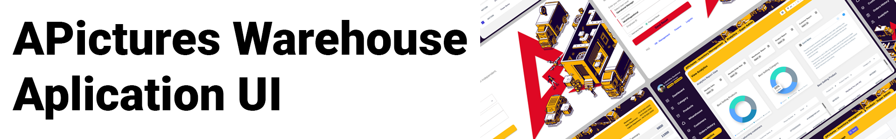

#  

 

***APictures Warehouse Automaton UI/UX Design Project***

## Project Description

The APictures UI Design Project is a custom inventory management system designed to help APictures keep track of their stock and improve their business. The system includes an inventory database that stores information on all the products in stock and a user interface that allows employees to add, remove, and update product information quickly.

### Features

The APictures UI Design Project includes the following features:

- Clean and user-friendly design
- Responsive UI that works on desktop and mobile devices
- Easy-to-use interface that allows employees to add, remove, and update product information quickly
- Inventory database that stores information on all products in stock
- Reports that help APictures identify areas where they need to improve their inventory management

### Technology Stack

The APictures UI Design Project is built using the following technologies:

- Figma 

## Screenshots

Here are some screenshots of the APictures UI Design Project:

## Figma Design

You can view the design for this project on Figma [here](https://www.figma.com/file/Cklx5khrTixJdLO63OV9LK/APictures---Inventory-Management?t=LEj07eQe9DsDWX5L-1).

## Contribution

We welcome contributions from the community. If you have any suggestions or improvements, please feel free to open an issue or pull request.

## License

The APictures UI Design Project is licensed under the MIT License. Please see the [LICENSE](LICENSE) file for more information.
